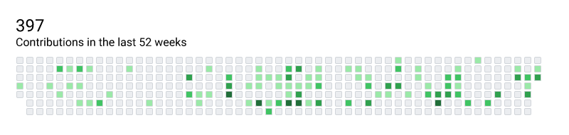
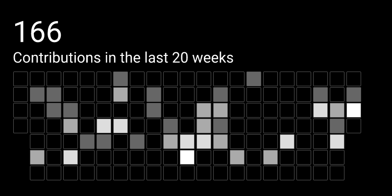

# `jamesthurley.github_commit_graph`

A [Slipway](https://slipway.co/) Component which uses a renders your last year
of GitHub contributions as a commit graph.

The output is a rendered commit graph as a canvas.

## Required Inputs

- `width`: The width of the output.
- `height`: The height of the output.
- `username`: The GitHub username you want to get the commit graph for.

## Optional Inputs

- `github_token`: A GitHub personal access token which has sufficient permissions to fetch the data.
Alternatively use the `GITHUB_TOKEN` environment variable.
- `theme`: An object containing zero or more of the following properties:
  - `horizontal_padding`: The padding to the left and right of the commit graph.
  - `vertical_padding`: The padding above and below the commit graph.
  - `background_color`: The background color.
  - `font_color`: The font color.
  - `day_border_width`: The border width of the day boxes.
  - `day_border_color`: The border color of the day boxes.
  - `day_palette`: The palette to use for the day boxes. This should be an array of colors.

## Suggested Permissions

### `--allow-http-prefix "https://api.github.com/"`

This component will need to access the GitHub API to fetch your data.

### `--allow-env-exact "GITHUB_TOKEN"`

This component will require access to a GitHub Personal Access Token with sufficient permissions.

Alternatively you can supply the Github Personal Access Token as part of the input
using the `githubToken` properties.

### `--allow-fonts`

This component uses the [`slipwayhq.jsx` Component](https://github.com/slipwayhq/slipway_jsx) component 
to render the commit graph, which requires fonts to render text.

### `--allow-registry-components`

This component uses the [`slipwayhq.jsx` Component](https://github.com/slipwayhq/slipway_jsx) component,
which itself loads other components, to render the chart.

## Example Usage

Test the component by running the following command and pasting in the input when prompted:
```
slipway run-component "jamesthurley.github_commit_graph.1.1.0" --allow-http-prefix "https://api.github.com/" --allow-fonts --allow-registry-components
```

Input:
```json
{
  "width": 800,
  "height": 190,
  "username": "<some_github_username>",
  "github_token": "<your_github_personal_access_token>",
  "theme": {
    "horizontal_padding": 22,
    "vertical_padding": 22
  }
}
```

Output:
```json
{
  "canvas": {
    "width": 800,
    "height": 190,
    "data": "<encoded_rgba_bytes_omitted>"
  }
}
```




Input:
```json
{
  "width": 800,
  "height": 400,
  "username": "<some_github_username>",
  "github_token": "<your_github_personal_access_token>",
  "weeks": 40,
  "theme": {
    "horizontal_padding": 22,
    "vertical_padding": 10,
    "background_color": "#000",
    "font_color": "#fff",
    "day_border_color": "#555",
    "day_palette": [
        "#000",
        "#666",
        "#aaa",
        "#ddd",
        "#fff"
    ],
  }
}
```

Output:
```json
{
  "canvas": {
    "width": 800,
    "height": 400,
    "data": "<encoded_rgba_bytes_omitted>"
  }
}
```

